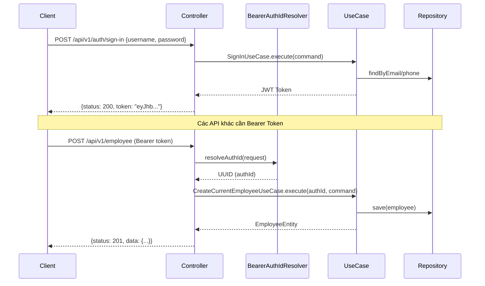

# Phân tích API — Identity Service

> **Stack**: Kotlin · Spring Boot 4.0.3 · Spring Security · JWT (jjwt 0.12.6) · Spring Data JPA · MySQL  
> **Base URL**: `http://localhost:8080`  
> **Auth**: Bearer Token (JWT)

---

## 1. Kiến trúc tổng quan

```
presentation/          ← Controllers, API interfaces, Request/Response models, Security resolvers
  └── api/             ← Interface định nghĩa mapping HTTP (AuthApi, ContractApi, ...)
  └── controller/      ← Implement các interface trên
  └── request/         ← DTO nhận từ client
  └── response/        ← DTO trả về client
  └── model/           ← Model tham chiếu (Ref Payload)

application/           ← Use cases (business logic)
  └── usecase/auth|employee|contract|profile|payroll/

domain/                ← Entity thuần (không phụ thuộc framework)
  └── entity/

infrastructures/       ← JPA persistence, Security config, JWT filter
  └── config/SecurityConfig.kt
  └── security/JwtAuthFilter.kt
  └── persistence/

common/                ← Constants, Exceptions, Utils dùng chung
```

Dự án tuân theo **Clean Architecture** (Presentation → Application → Domain → Infrastructure).

---

## 2. Danh sách toàn bộ API

### 🔐 Auth API — `/api/v1/auth` *(Không cần token)*

| # | Method | Endpoint | Mô tả |
|---|--------|----------|--------|
| 1 | `POST` | `/api/v1/auth/sign-in` | Đăng nhập, trả về JWT |
| 2 | `POST` | `/api/v1/auth/sign-up` | Đăng ký tài khoản mới |

### 👤 Employee API — `/api/v1/employee` *(Cần Bearer Token)*

| # | Method | Endpoint | Mô tả |
|---|--------|----------|--------|
| 3 | `POST` | `/api/v1/employee` | Tạo hồ sơ nhân viên |
| 4 | `GET` | `/api/v1/employee` | Lấy thông tin nhân viên hiện tại |
| 5 | `PUT` | `/api/v1/employee` | Cập nhật thông tin nhân viên |
| 6 | `DELETE` | `/api/v1/employee` | Xóa nhân viên hiện tại |

### 📋 Profile API — `/api/v1/profile` *(Cần Bearer Token)*

| # | Method | Endpoint | Mô tả |
|---|--------|----------|--------|
| 7 | `POST` | `/api/v1/profile` | Tạo profile cá nhân |
| 8 | `GET` | `/api/v1/profile` | Lấy profile cá nhân |
| 9 | `PUT` | `/api/v1/profile` | Cập nhật profile |
| 10 | `DELETE` | `/api/v1/profile` | Xóa profile |

### 📄 Contract API — `/api/v1/contracts` *(Cần Bearer Token)*

| # | Method | Endpoint | Mô tả |
|---|--------|----------|--------|
| 11 | `POST` | `/api/v1/contracts` | Tạo hợp đồng lao động |
| 12 | `GET` | `/api/v1/contracts` | Lấy hợp đồng hiện tại |
| 13 | `PUT` | `/api/v1/contracts` | Cập nhật hợp đồng |
| 14 | `DELETE` | `/api/v1/contracts` | Xóa hợp đồng |

### 💰 Payroll API — `/api/v1/payroll` *(Cần Bearer Token)*

| # | Method | Endpoint | Mô tả |
|---|--------|----------|--------|
| 15 | `POST` | `/api/v1/payroll` | Tạo thông tin lương |
| 16 | `GET` | `/api/v1/payroll` | Lấy thông tin lương |
| 17 | `PUT` | `/api/v1/payroll` | Cập nhật lương |
| 18 | `DELETE` | `/api/v1/payroll` | Xóa thông tin lương |

---

## 3. Chi tiết Request Body

### API 1 — POST `/api/v1/auth/sign-in`
```json
{
  "username": "user@example.com",
  "password": "yourpassword"
}
```

### API 2 — POST `/api/v1/auth/sign-up`
```json
{
  "email": "user@example.com",
  "phone": "0901234567",
  "password": "yourpassword"
}
```

### API 3 — POST `/api/v1/employee`
```json
{
  "department": "Engineering",
  "position": "Developer",
  "status": "ACTIVE",
  "workingType": "FULL_TIME",
  "isActive": true,
  "manager": {
    "id": { "value": "manager-employee-id" },
    "authId": { "value": "manager-auth-uuid" }
  },
  "createdAt": "2024-01-01T00:00:00.000+00:00",
  "updatedAt": "2024-01-01T00:00:00.000+00:00",
  "createdBy": "admin",
  "note": "Nhân viên mới"
}
```

### API 5 — PUT `/api/v1/employee`
```json
{
  "department": "Engineering",
  "position": "Senior Developer",
  "status": "ACTIVE",
  "workingType": "FULL_TIME",
  "isActive": true,
  "manager": null,
  "updatedAt": "2024-06-01T00:00:00.000+00:00",
  "note": "Cập nhật chức vụ"
}
```

### API 7 — POST `/api/v1/profile`
```json
{
  "name": "Nguyễn Văn A",
  "gender": "MALE",
  "identityType": "CCCD",
  "identityNumber": "012345678901",
  "identityIssueDate": 20200101,
  "identityIssuePlace": "Hà Nội",
  "email": "nguyenvana@example.com",
  "phone": "0901234567",
  "emergencyName": "Nguyễn Thị B",
  "emergencyPhone": "0909999999",
  "emergencyRelationship": "Vợ",
  "dateOfBirth": "1990-01-15",
  "health": "Tốt",
  "married": "MARRIED",
  "permanentResidence": "Hà Nội",
  "nowResidence": "TP.HCM",
  "avatarUrl": "https://example.com/avatar.jpg",
  "educationLevel": "UNIVERSITY",
  "major": "Computer Science",
  "certificate": ["AWS Certified", "Oracle DBA"],
  "skillSet": ["Java", "Kotlin", "Spring Boot"],
  "expYears": 5
}
```

### API 9 — PUT `/api/v1/profile`
```json
{
  "profile": {
    "id": { "value": "profile-id-here" }
  },
  "name": "Nguyễn Văn A",
  "gender": "MALE",
  "identityType": "CCCD",
  "identityNumber": "012345678901",
  "identityIssueDate": 20200101,
  "identityIssuePlace": "Hà Nội",
  "email": "nguyenvana@example.com",
  "phone": "0901234567",
  "emergencyName": "Nguyễn Thị B",
  "emergencyPhone": "0909999999",
  "emergencyRelationship": "Vợ",
  "dateOfBirth": "1990-01-15",
  "health": "Tốt",
  "married": "MARRIED",
  "permanentResidence": "Hà Nội",
  "nowResidence": "TP.HCM",
  "avatarUrl": null,
  "educationLevel": "UNIVERSITY",
  "major": "Computer Science",
  "certificate": ["AWS Certified"],
  "skillSet": ["Kotlin", "Spring Boot"],
  "expYears": 6
}
```

### API 11 — POST `/api/v1/contracts`
```json
{
  "typeContract": "PERMANENT",
  "startDate": "2024-01-01T00:00:00.000+00:00",
  "endDate": null,
  "contractExpire": null,
  "probationStartDate": "2024-01-01T00:00:00.000+00:00",
  "probationEndDate": "2024-03-01T00:00:00.000+00:00",
  "taxCode": "8901234567",
  "socialInsuranceNumber": "SN123456789",
  "healthInsuranceNumber": "HI987654321"
}
```

### API 13 — PUT `/api/v1/contracts`
```json
{
  "contract": {
    "id": { "value": "contract-id-here" }
  },
  "typeContract": "FIXED_TERM",
  "startDate": "2024-01-01T00:00:00.000+00:00",
  "endDate": "2025-01-01T00:00:00.000+00:00",
  "contractExpire": "2025-01-01T00:00:00.000+00:00",
  "probationStartDate": null,
  "probationEndDate": null,
  "taxCode": "8901234567",
  "socialInsuranceNumber": "SN123456789",
  "healthInsuranceNumber": "HI987654321"
}
```

### API 15 — POST `/api/v1/payroll`
```json
{
  "salaryType": "MONTHLY",
  "baseSalary": 20000000.0,
  "bonusSalary": 2000000.0,
  "overTimeRate": 1.5,
  "totalIncome": 22000000.0,
  "currency": "VND",
  "payDay": "2024-01-25T00:00:00.000+00:00",
  "bankAccountNumber": "123456789012",
  "bankAccountName": "NGUYEN VAN A",
  "bankName": "Vietcombank",
  "bankBranch": "Hà Nội"
}
```

### API 17 — PUT `/api/v1/payroll`
```json
{
  "payroll": {
    "id": { "value": "payroll-id-here" }
  },
  "salaryType": "MONTHLY",
  "baseSalary": 25000000.0,
  "bonusSalary": 3000000.0,
  "overTimeRate": 1.5,
  "totalIncome": 28000000.0,
  "currency": "VND",
  "payDay": "2024-02-25T00:00:00.000+00:00",
  "bankAccountNumber": "123456789012",
  "bankAccountName": "NGUYEN VAN A",
  "bankName": "Vietcombank",
  "bankBranch": null
}
```

---

## 4. Hướng dẫn sử dụng Postman

### Bước 0: Cài biến môi trường (Environment Variables)

Trong Postman, tạo một Environment mới với các biến:

| Variable | Initial Value |
|----------|--------------|
| `base_url` | `http://localhost:8080` |
| `token` | *(để trống, sẽ tự điền sau khi sign-in)* |

---

### Bước 1: Sign-up (Đăng ký)

- **Method**: `POST`
- **URL**: `{{base_url}}/api/v1/auth/sign-up`
- **Headers**: `Content-Type: application/json`
- **Body (raw JSON)**:
```json
{
  "email": "test@example.com",
  "phone": "0901234567",
  "password": "Test@1234"
}
```

---

### Bước 2: Sign-in (Đăng nhập) — Lấy JWT

- **Method**: `POST`
- **URL**: `{{base_url}}/api/v1/auth/sign-in`
- **Headers**: `Content-Type: application/json`
- **Body (raw JSON)**:
```json
{
  "username": "test@example.com",
  "password": "Test@1234"
}
```

**Tự động lưu token** — Tab **Tests** trong Postman, thêm script:
```javascript
const json = pm.response.json();
if (json.token) {
    pm.environment.set("token", json.token);
}
```

---

### Bước 3: Các API cần token

Với tất cả API từ #3 đến #18, thêm Authorization header:

- **Tab Authorization** → Type: `Bearer Token` → Token: `{{token}}`

hoặc thêm thủ công trong **Headers**:
```
Authorization: Bearer {{token}}
```

---

### Thứ tự gọi API được khuyến nghị

```
sign-up → sign-in → create employee → create profile → create contract → create payroll
                   → get employee   → get profile    → get contract    → get payroll
                   → update ...     → update ...     → update ...      → update ...
                   → delete ...     → delete ...     → delete ...      → delete ...
```

> [!NOTE]
> Vì mỗi user chỉ có **một** employee/profile/contract/payroll (quan hệ 1-1), các API GET/PUT/DELETE không cần truyền ID trong path — hệ thống tự xác định từ JWT token.

---

## 5. Phân tích: Ưu điểm

| # | Ưu điểm | Chi tiết |
|---|---------|----------|
| ✅ 1 | **Clean Architecture rõ ràng** | Tách bạch Presentation → Application → Domain → Infrastructure. Domain entity không phụ thuộc framework |
| ✅ 2 | **Use Case pattern** | Mỗi hành động là một UseCase riêng biệt (`CreateContractUseCase`, `UpdateContractUseCase`...), dễ test và bảo trì |
| ✅ 3 | **Stateless JWT Auth** | Sử dụng JJWT 0.12.6, session `STATELESS`, phù hợp cho microservices/REST API |
| ✅ 4 | **Global Exception Handler** | `GlobalExceptionHandler` xử lý tập trung tất cả exceptions, trả về cấu trúc lỗi nhất quán |
| ✅ 5 | **API Interface tách biệt** | Tách `AuthApi`, `EmployeeApi`... làm interface riêng — controllers chỉ implement, dễ docs/mock |
| ✅ 6 | **Response nhất quán** | Tất cả response đều có `status`, `message`, `data` nhất quán |
| ✅ 7 | **BCrypt password hashing** | Mật khẩu được hash bằng BCrypt |
| ✅ 8 | **Kotlin Null Safety** | Tận dụng `?` (nullable) để phân biệt field bắt buộc/tùy chọn rõ ràng |

---

## 6. Phân tích: Nhược điểm / Điểm có thể cải thiện

| # | Vấn đề | Vị trí | Giải thích |
|---|--------|--------|------------|
| ⚠️ 1 | **JWT Secret để plaintext trong config** | `application.properties` line 3 | Secret key hardcode trong file config, dễ lộ khi commit git. Nên dùng env variable hoặc Vault |
| ⚠️ 2 | **`username` trong SignIn thực ra là email/phone** | `SignInRequest.kt` | Field tên là `username` nhưng `SignUpRequest` chỉ có `email` + `phone`, gây nhầm lẫn. Nên dùng tên nhất quán |
| ⚠️ 3 | **Không có `@Valid` validation** | Tất cả Request classes | Không có annotation `@NotBlank`, `@Email`, `@Size`... nên không validate input đầu vào, dễ gây lỗi xuống DB |
| ⚠️ 4 | **`createdAt`, `updatedAt` do client gửi lên** | `CreateEmployeeRequest.kt` | Timestamp nên được server tự sinh (thường dùng `@CreatedDate`, `@LastModifiedDate`), client không nên kiểm soát |
| ⚠️ 5 | **Catch `Exception` chung quá rộng** | `BearerAuthIdResolver.kt` line 20 | `catch (_: Exception)` ẩn mọi lỗi JWT (hết hạn, sai chữ ký, ...) thành `EmployeeNotFoundException` — khó debug |
| ⚠️ 6 | **`EmployeeNotFoundException` dùng sai ngữ cảnh** | `BearerAuthIdResolver.kt` | Ném `EmployeeNotFoundException` khi không có/sai token — sai semantic, nên là `UnauthorizedException` |
| ⚠️ 7 | **Mỗi user chỉ có 1 contract/payroll (1-1)** | `ContractApi`, `PayrollApi` | Không có ID trong URL, không hỗ trợ lịch sử hợp đồng/lương — hạn chế business thực tế |
| ⚠️ 8 | **`identityIssueDate` kiểu `Int`** | `CreateProfileRequest.kt` line 8 | Ngày tháng dùng `Int` thay vì `LocalDate`/`String` — không rõ format (20240101 hay epoch?) |
| ⚠️ 9 | **`GetContractUseCase.kt` trống** | `application/usecase/contract/` | File `GetContractUseCase.kt` trong module `application` (root) hoàn toàn trống (0 bytes) |
| ⚠️ 10 | **Thiếu Swagger/OpenAPI docs** | Toàn bộ project | Không có tài liệu API tự động, khó onboard developer mới |
| ⚠️ 11 | **Thiếu logging** | Controllers/UseCases | Không có log `slf4j`/`logback`, khó trace lỗi production |
| ⚠️ 12 | **Password root DB hardcode** | `application.properties` | `spring.datasource.password=password` để plaintext, nên dùng env variable |

---

## 7. Sơ đồ luồng hoạt động


